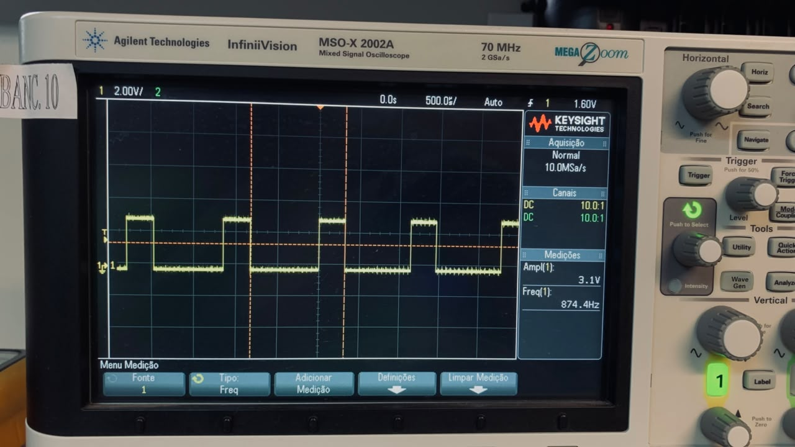
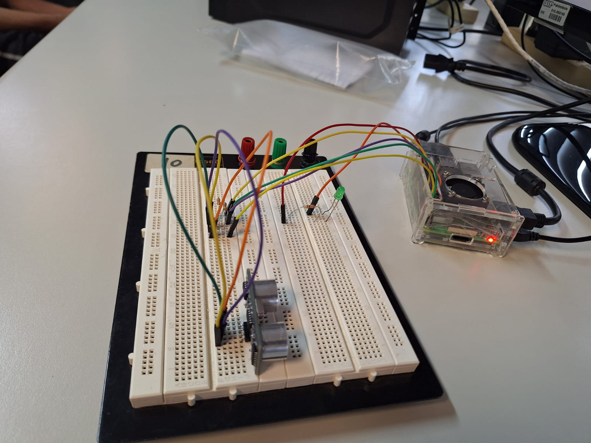
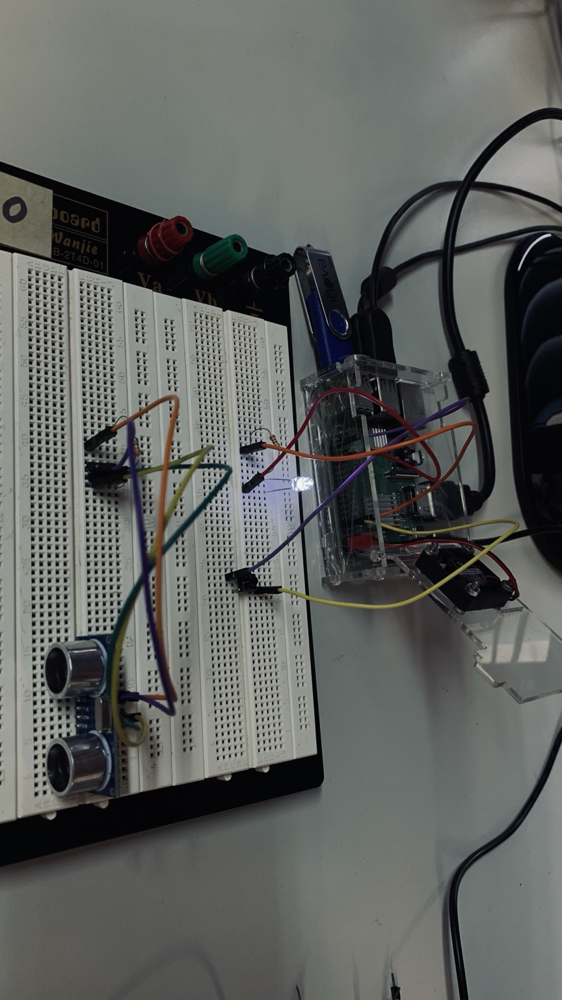
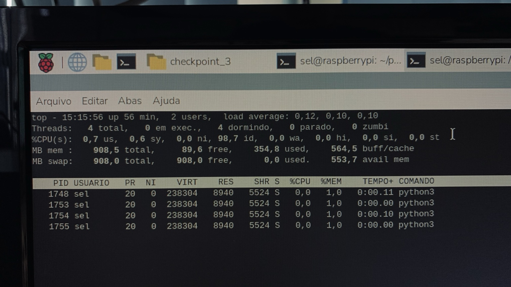

# Prática 3 — GPIO, temporização e concorrência em Raspberry Pi

**Disciplina:** SEL0337 — Projetos em Sistemas Embarcados

| Integrante | NUSP |
|---|---:|
| João Vitor Miranda Sousa | 14802702 |
| Fernando Shoji Ogusuku | 15636682 |
| Eduardo Yumoto Carvalheira | 15636150 |

## Resumo

Esta prática reuniu três checkpoints desenvolvidos em Raspberry Pi com Python e `RPi.GPIO`, abordando progressivamente entrada e saída digital, temporização, PWM, aquisição de distância e programação concorrente. No primeiro checkpoint foram trabalhados GPIO, detecção de eventos e temporização básica. No segundo, foram implementados controle por PWM e aquisição de distância com o sensor ultrassônico HC-SR04. No terceiro, a aplicação foi reorganizada em tarefas concorrentes utilizando `threading.Thread`, `threading.Timer`, `threading.Event` e `threading.Lock`. Os códigos foram testados em bancada e acompanhados por evidências experimentais e históricos de execução.

## 1. Plataforma experimental

Os ensaios foram realizados em uma **Raspberry Pi 3 Model B+**, executando Python em ambiente Linux. A biblioteca `RPi.GPIO` foi utilizada para configuração e controle dos pinos digitais.

A documentação detalhada de cada etapa está disponível nos diretórios:

- [`checkpoint_1/`](checkpoint_1/)
- [`checkpoint_2/`](checkpoint_2/)
- [`checkpoint_3/`](checkpoint_3/)

## 2. Checkpoint 1 — GPIO e temporização

O primeiro checkpoint introduziu o uso dos GPIOs da Raspberry Pi em Python por meio de dois programas.

O script [`cp1_botao_led.py`](checkpoint_1/cp1_botao_led.py) implementa a interação entre um botão e um LED, permitindo trabalhar com entrada digital, saída digital e tratamento de eventos de GPIO. A configuração do botão utiliza pull-up interno, mantendo um estado lógico definido sem necessidade de resistor externo de pull-up.

O script [`cp1_contagem_regressiva.py`](checkpoint_1/cp1_contagem_regressiva.py) implementa uma contagem regressiva a partir de um tempo informado pelo usuário. A entrada é validada antes do início da contagem, e a atualização do tempo é apresentada de forma contínua no terminal.

Essa etapa consolidou a configuração básica de GPIO, validação de entrada, temporização e finalização segura da aplicação.

## 3. Checkpoint 2 — PWM e sensor ultrassônico

O segundo checkpoint ampliou a interação com periféricos por meio de duas aplicações independentes.

### 3.1 Controle por PWM

O script [`cp2_pwm.py`](checkpoint_2/cp2_pwm.py) implementa o acionamento de um LED utilizando modulação por largura de pulso. A aplicação permite observar a relação entre frequência, duty cycle e comportamento da saída digital.

O sinal PWM foi validado experimentalmente com osciloscópio, permitindo comparar o comportamento programado com a forma de onda observada em bancada.

<em>Figura 1 — Exemplo de sinal PWM observado durante os ensaios do Checkpoint 2.</em>

### 3.2 Medição de distância com HC-SR04

O script [`cp2_hcsr04_led.py`](checkpoint_2/cp2_hcsr04_led.py) utiliza o sensor ultrassônico HC-SR04 para estimar a distância de um objeto. O LED é acionado de acordo com a distância medida, permitindo associar aquisição de sensor e atuação digital.

A montagem foi testada fisicamente e o comportamento foi verificado para diferentes posições do obstáculo. O circuito também respeitou os cuidados necessários de interface elétrica entre o sinal de retorno do sensor e a Raspberry Pi.

<em>Figura 2 — Montagem experimental utilizada na medição de distância com o HC-SR04.</em>

A documentação completa do checkpoint, incluindo as demais fotografias e resultados, está em [`checkpoint_2/README.md`](checkpoint_2/README.md).

## 4. Checkpoint 3 — Programação concorrente

O terceiro checkpoint introduziu mecanismos de concorrência e sincronização em Python. A implementação principal está em [`cp3_threads_gpio.py`](checkpoint_3/cp3_threads_gpio.py).

A aplicação executa o acionamento periódico de um LED em uma thread dedicada, enquanto um botão altera a frequência de operação entre **1,0 Hz** e **5,0 Hz**. A entrada é tratada por detecção de eventos de GPIO, evitando polling contínuo.

Os principais mecanismos empregados foram:

| Recurso | Papel na aplicação |
|---|---|
| `threading.Thread` | Execução concorrente da tarefa periódica do LED |
| `threading.Timer` | Temporização do tempo total de execução |
| `threading.Event` | Sinalização coordenada do término das tarefas |
| `threading.Lock` | Proteção da variável de frequência compartilhada |
| `GPIO.add_event_detect()` | Tratamento do botão orientado a eventos |

A variável de frequência é compartilhada entre a thread responsável pelo LED e o callback do botão. O acesso é protegido com `Lock`, evitando acessos concorrentes não sincronizados ao estado compartilhado.

Ao término do intervalo definido pelo usuário, o `Timer` executa um callback que sinaliza o `Event` de encerramento. O bloco de finalização garante o desligamento do LED, a remoção da detecção de eventos e a liberação dos GPIOs com `GPIO.cleanup()`.

<em>Figura 3 — Montagem utilizada na validação experimental do Checkpoint 3.</em>

Durante a execução, o processo Python foi inspecionado com ferramentas do Linux. O comando `top -H` apresentou múltiplas threads associadas ao processo em execução.

<em>Figura 4 — Inspeção das threads associadas ao processo Python durante a execução.</em>

A documentação detalhada, os históricos dos terminais e o vídeo de demonstração estão disponíveis em [`checkpoint_3/README.md`](checkpoint_3/README.md).

## 5. Multiprocessing × multithreading

Processos e threads permitem estruturar tarefas concorrentes, mas apresentam características distintas.

| Aspecto | Multiprocessing | Multithreading |
|---|---|---|
| Espaço de memória | Separado entre processos | Compartilhado entre threads |
| Comunicação | Requer IPC, filas, pipes ou memória compartilhada | Compartilhamento direto de objetos |
| Custo de criação | Maior | Menor |
| Isolamento | Maior entre tarefas | Menor, pois compartilham o processo |
| Sincronização | Necessária quando há recursos compartilhados | Necessária para dados compartilhados |
| Paralelismo em tarefas CPU-bound em CPython | Pode explorar múltiplos núcleos | Limitado pelo GIL para bytecode Python |
| Adequação a GPIO, eventos e temporização | Possível, porém com maior complexidade de comunicação | Natural para tarefas de I/O e estados compartilhados |

No contexto deste checkpoint, **multithreading foi a escolha mais adequada**. As tarefas são predominantemente relacionadas a GPIO, temporização e espera por eventos, e não a processamento intensivo de CPU. Além disso, o botão e a thread do LED precisam acessar o mesmo estado de frequência, o que pode ser tratado de forma simples com memória compartilhada e `threading.Lock`.

Uma solução baseada em `multiprocessing` também seria possível, mas exigiria mecanismos adicionais de comunicação entre processos para compartilhar a frequência e coordenar o encerramento. Em contrapartida, processos seriam mais interessantes em uma aplicação com tarefas computacionalmente intensivas, necessidade de maior isolamento ou exploração explícita de múltiplos núcleos para processamento paralelo.

## 6. Resultados gerais

Os três checkpoints foram executados e testados em bancada. Ao longo da prática foi possível validar:

- leitura e acionamento de GPIOs;
- tratamento de botão por eventos;
- temporização e validação de entrada;
- geração e observação experimental de PWM;
- aquisição de distância com sensor ultrassônico;
- controle de periféricos em função de grandezas medidas;
- criação e coordenação de tarefas concorrentes;
- sincronização de estado compartilhado;
- inspeção de threads no sistema operacional;
- finalização segura e liberação dos GPIOs.

A progressão dos checkpoints permitiu partir de operações simples de entrada e saída até uma aplicação concorrente com sincronização e tratamento orientado a eventos.

## 7. Conclusão

A Prática 3 integrou conceitos de programação, interface com hardware e concorrência em uma plataforma embarcada real. Os checkpoints demonstraram a evolução desde o controle básico de GPIO até o desenvolvimento de uma aplicação com múltiplos fluxos de execução e mecanismos explícitos de sincronização.

A validação experimental foi essencial para relacionar o comportamento previsto em software com a resposta efetiva dos periféricos. No Checkpoint 3, o uso de threads mostrou-se adequado ao perfil de tarefas de I/O e temporização da aplicação, enquanto `Event` e `Lock` permitiram coordenar o encerramento e proteger o estado compartilhado.

Os códigos, históricos e evidências experimentais permanecem organizados nos respectivos diretórios deste repositório, permitindo a reprodução e a análise de cada etapa da prática.
