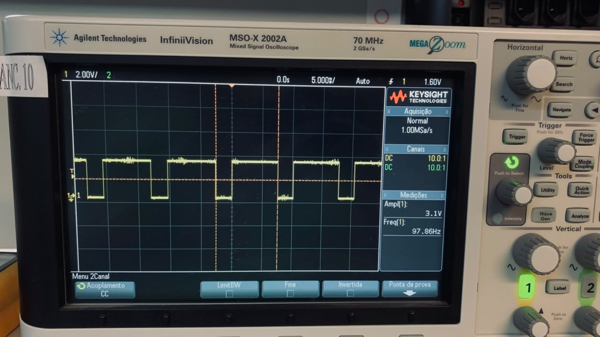
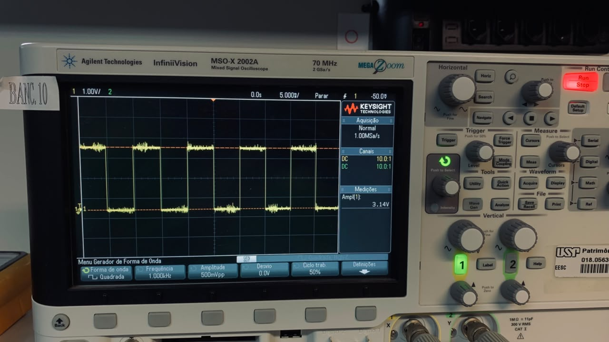
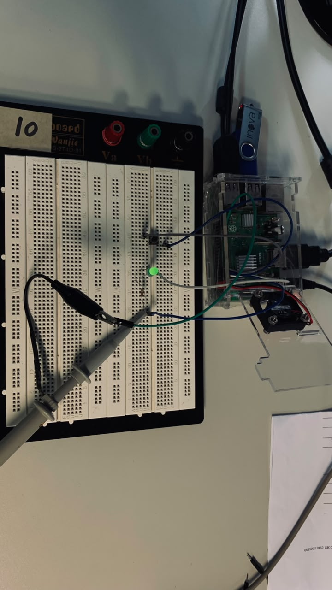
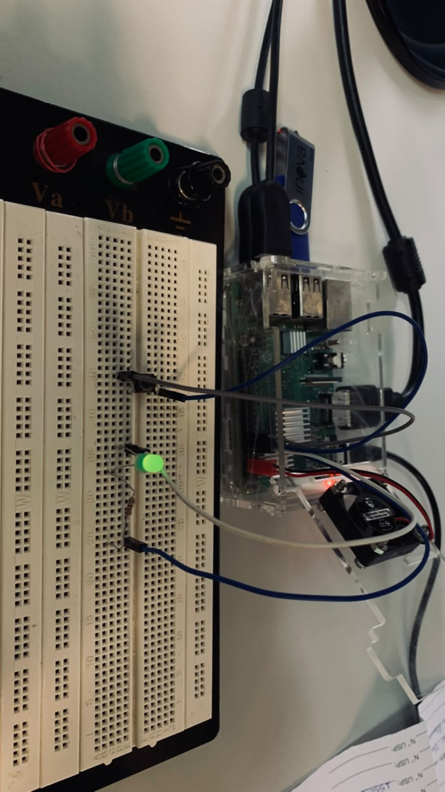
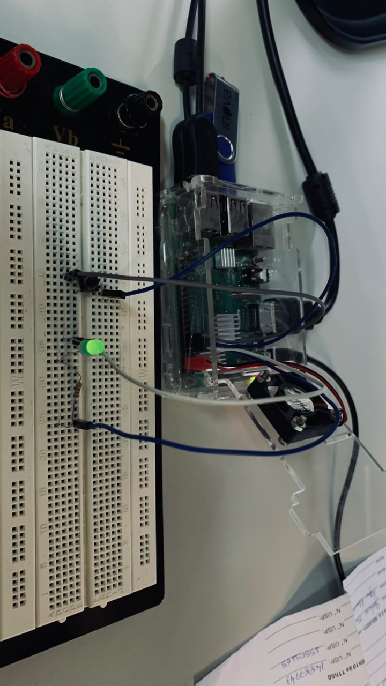
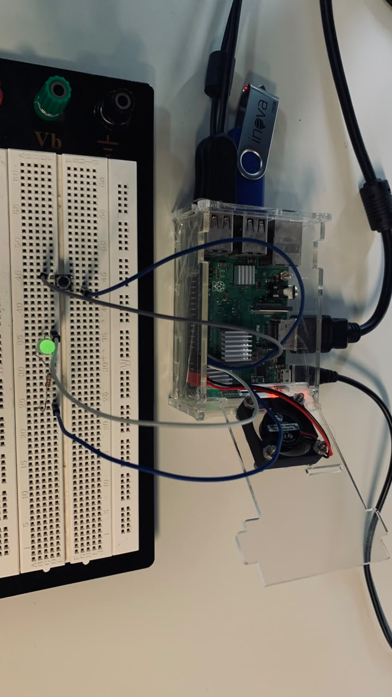
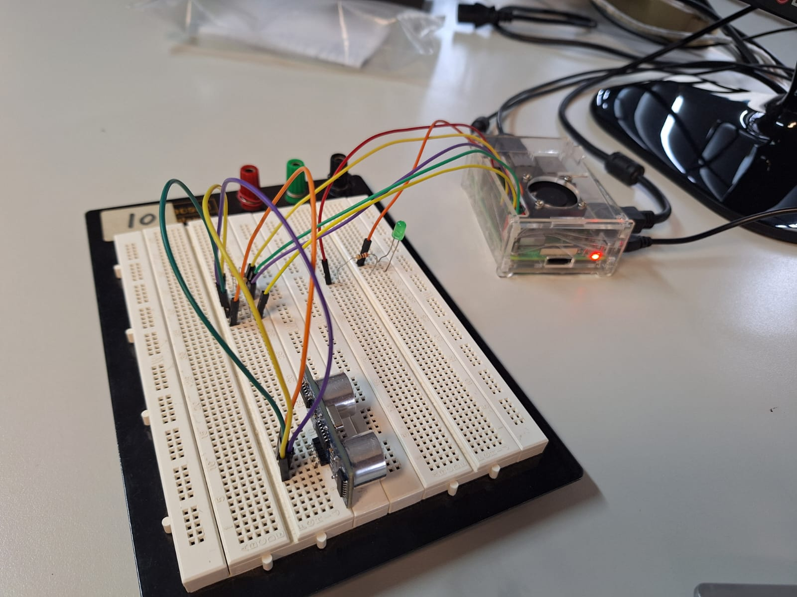
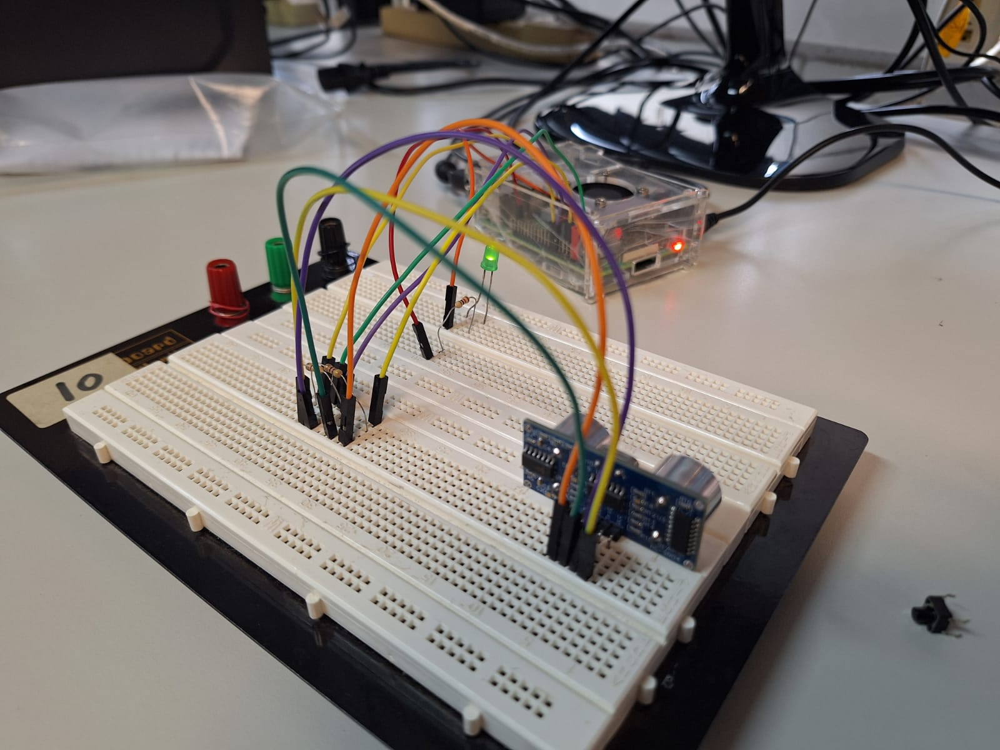

# SEL0337 — Prática 3 — Checkpoint 2

Implementação de duas aplicações com GPIO na Raspberry Pi 3B+: geração de PWM para acionamento de LED e medição de distância com o sensor ultrassônico HC-SR04.

> Disciplina: **SEL0337 — Projetos em Sistemas Embarcados**

## Integrantes

- **João Vitor Miranda Sousa** — NUSP 14802702
- **Fernando Shoji Ogusuku** — NUSP 15636682
- **Eduardo Yumoto Carvalheira** — NUSP 15636150

---

## Visão geral

O Checkpoint 2 explora o uso de GPIOs, periféricos e bibliotecas Python em uma Raspberry Pi por meio de duas implementações:

1. **PWM com LED** — geração de sinal PWM via `RPi.GPIO`, com ajuste de frequência e duty cycle pelo terminal e verificação experimental no osciloscópio.
2. **HC-SR04 + LED** — leitura de distância com `gpiozero` e acionamento de um LED quando um objeto é detectado dentro de um limiar de 20 cm.

As montagens foram implementadas e testadas em bancada, e as evidências experimentais estão reunidas em [`imagens/`](imagens/).

---

## Estrutura do diretório

```text
checkpoint_2/
├── README.md
├── cp2_pwm.py
├── cp2_hcsr04_led.py
├── entrega_checkpoint_2.txt
├── historico_checkpoint2.txt
└── imagens/
    ├── hcsr04_montagem_01.jpeg
    ├── hcsr04_montagem_02.jpeg
    ├── hcsr04_montagem_03.jpeg
    ├── pwm_montagem_01.jpeg
    ├── pwm_montagem_02.jpeg
    ├── pwm_montagem_03.jpeg
    ├── pwm_montagem_04.jpeg
    ├── pwm_osciloscopio_97_86Hz.jpeg
    ├── pwm_osciloscopio_874_4Hz.jpeg
    └── pwm_osciloscopio_onda_quadrada.jpeg
```

---

## 1. Controle PWM com LED

### Objetivo

Gerar um sinal PWM em uma GPIO da Raspberry Pi e permitir a alteração, em tempo de execução, de:

- frequência;
- duty cycle.

A resposta é observada tanto no brilho do LED quanto na forma de onda medida no osciloscópio.

### Implementação

Arquivo: [`cp2_pwm.py`](cp2_pwm.py)

Biblioteca utilizada:

```python
import RPi.GPIO as GPIO
```

Configuração principal:

| Parâmetro | Valor |
|---|---:|
| GPIO do LED | BCM 17 |
| Pino físico | 11 |
| Frequência inicial | 100 Hz |
| Duty cycle inicial | 0% |

O programa valida as entradas fornecidas pelo usuário e aplica os novos valores com:

```python
pwm.ChangeFrequency(frequencia)
pwm.ChangeDutyCycle(duty)
```

Ao final da execução, o PWM é interrompido e as GPIOs são liberadas com `GPIO.cleanup()`.

### Execução

```bash
python3 cp2_pwm.py
```

Exemplos de combinações utilizadas durante os testes:

```text
100 Hz / 25%
100 Hz / 50%
100 Hz / 75%
500 Hz / 50%
1000 Hz / 50%
```

### Evidências experimentais

As formas de onda abaixo foram registradas diretamente no osciloscópio durante os ensaios.

<table>
<tr>
<td align="center"><strong>Forma de onda — ~97,86 Hz</strong></td>
<td align="center"><strong>Forma de onda — ~874,4 Hz</strong></td>
</tr>
<tr>
<td></td>
<td></td>
</tr>
</table>

<p align="center">
  <strong>Registro adicional da forma de onda PWM</strong><br>
  
</p>

### Montagem em bancada

<table>
<tr>
<td></td>
<td></td>
</tr>
<tr>
<td></td>
<td></td>
</tr>
</table>

---

## 2. Sensor ultrassônico HC-SR04 + LED

### Objetivo

Medir continuamente a distância entre o sensor HC-SR04 e um objeto e utilizar essa informação para acionar um LED.

O comportamento implementado é:

```text
distância ≤ 20 cm  → LED aceso
distância > 20 cm  → LED apagado
```

### Implementação

Arquivo: [`cp2_hcsr04_led.py`](cp2_hcsr04_led.py)

Biblioteca utilizada:

```python
from gpiozero import DistanceSensor, LED
```

Pinagem utilizada:

| Sinal | GPIO BCM | Pino físico |
|---|---:|---:|
| Trigger | 23 | 16 |
| Echo | 24 | 18 |
| LED | 17 | 11 |

O limiar de detecção foi definido como:

```python
LIMIAR_M = 0.20
```

O acionamento do LED é realizado por callbacks associados ao sensor:

```python
sensor.when_in_range = objeto_perto
sensor.when_out_of_range = objeto_longe
```

A distância medida também é atualizada continuamente no terminal.

### Execução

```bash
python3 cp2_hcsr04_led.py
```

### Montagem em bancada

<table>
<tr>
<td></td>
<td></td>
<td></td>
</tr>
</table>

> **Atenção:** o pino `ECHO` do HC-SR04 não deve ser conectado diretamente à entrada GPIO da Raspberry Pi. Foi utilizado um divisor resistivo para adequação do nível lógico antes do GPIO24.

---

## Ambiente utilizado

A implementação foi realizada em uma **Raspberry Pi 3 Model B Plus Rev 1.3**, com ambiente Linux e Python.

Dependências principais:

- Python 3;
- `RPi.GPIO`;
- `gpiozero`.

Para verificar as dependências instaladas no ambiente virtual:

```bash
pip freeze
```

---

## Encerramento seguro

Os scripts foram implementados de forma a liberar os recursos utilizados ao término da execução.

No PWM:

```python
pwm.stop()
GPIO.cleanup()
```

Na aplicação com HC-SR04:

```python
led.off()
sensor.close()
led.close()
```

Isso evita deixar periféricos ou GPIOs em estados indesejados após a interrupção dos programas.

---

## Arquivos de entrega

Os scripts principais deste checkpoint são:

- [`cp2_pwm.py`](cp2_pwm.py)
- [`cp2_hcsr04_led.py`](cp2_hcsr04_led.py)

O arquivo [`entrega_checkpoint_2.txt`](entrega_checkpoint_2.txt) contém o link direto para este diretório no GitHub.

As fotografias permanecem versionadas no repositório como evidência das montagens e também poderão ser reutilizadas na documentação final da Prática 3.
