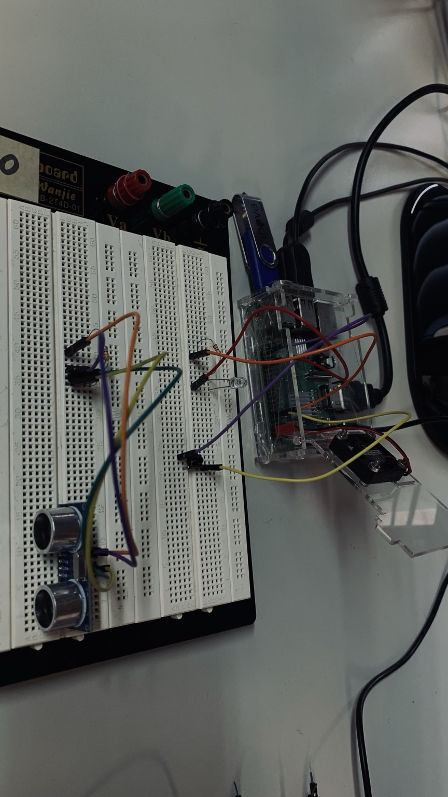
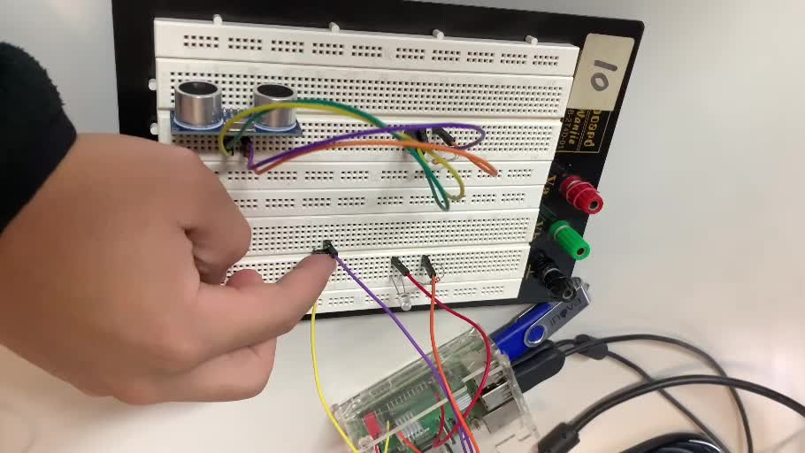

# Prática 3 — Checkpoint 3

**Disciplina:** SEL0337 — Projetos em Sistemas Embarcados

**Integrantes:**

- João Vitor Miranda Sousa — NUSP 14802702
- Fernando Shoji Ogusuku — NUSP 15636682
- Eduardo Yumoto Carvalheira — NUSP 15636150

---

## 1. Objetivo

O Checkpoint 3 teve como objetivo desenvolver uma aplicação concorrente em Python utilizando os GPIOs da Raspberry Pi e mecanismos de execução baseados em `threading`.

A aplicação implementada realiza:

- acionamento intermitente de um LED;
- alteração da frequência de pisca por meio de um botão;
- tratamento do botão por detecção de eventos, sem polling;
- temporização da execução utilizando `threading.Timer`;
- encerramento automático por callback;
- sincronização do acesso ao estado compartilhado utilizando `threading.Lock`.

O código principal está disponível em [`cp3_threads_gpio.py`](cp3_threads_gpio.py).

---

## 2. Hardware utilizado

A implementação foi executada e testada em uma **Raspberry Pi 3 Model B+**.

| Elemento | GPIO BCM | Pino físico | Função |
|---|---:|---:|---|
| LED | GPIO 17 | 11 | Saída digital |
| Botão | GPIO 18 | 12 | Entrada digital com `PUD_UP` |
| GND | — | GND | Referência elétrica |

O botão foi conectado entre o GPIO 18 e o GND, utilizando o resistor de pull-up interno da Raspberry Pi por meio de `GPIO.PUD_UP`.

O LED foi conectado ao GPIO 17 com resistor limitador de corrente.

> **Observação:** o sensor ultrassônico HC-SR04 visível em algumas fotografias permaneceu fisicamente na protoboard devido à reutilização da montagem do Checkpoint 2. O sensor não participa da aplicação desenvolvida neste checkpoint.

---

## 3. Arquitetura da aplicação

A aplicação foi organizada em tarefas concorrentes com responsabilidades distintas.

### 3.1 Thread de acionamento do LED

A função `piscar_led()` é executada em uma thread dedicada e alterna continuamente o estado lógico do LED.

A frequência pode assumir dois valores:

- **1,0 Hz** — modo lento;
- **5,0 Hz** — modo rápido.

O intervalo entre duas alterações consecutivas do estado do LED corresponde a meio período:

```python
meio_periodo = 1.0 / (2.0 * frequencia)
```

Para realizar a espera foi utilizado:

```python
fim_programa.wait(meio_periodo)
```

em vez de `time.sleep()`.

Essa escolha permite que a thread seja liberada imediatamente caso o encerramento da aplicação seja solicitado, sem a necessidade de aguardar o término completo do intervalo de espera.

### 3.2 Detecção de eventos do botão

A leitura do botão não é realizada por polling.

Foi utilizada a detecção de borda da biblioteca `RPi.GPIO`:

```python
GPIO.add_event_detect(
    BOTAO_GPIO,
    GPIO.FALLING,
    callback=alternar_frequencia,
    bouncetime=DEBOUNCE_MS,
)
```

Quando uma borda de descida é detectada, a função `alternar_frequencia()` é executada como callback.

Cada acionamento alterna a frequência do LED entre **1 Hz** e **5 Hz**.

O parâmetro `bouncetime` auxilia no tratamento do bouncing mecânico do botão.

### 3.3 Sincronização com `Lock`

A variável `frequencia_atual_hz` é compartilhada entre a thread responsável pelo LED e o callback associado ao botão.

Para sincronizar o acesso a esse estado foi utilizado:

```python
threading.Lock()
```

As operações de leitura e alteração da frequência são realizadas em regiões protegidas pelo `Lock`, evitando acessos concorrentes não sincronizados ao recurso compartilhado.

### 3.4 Temporização com `Timer`

O tempo total de execução é informado pelo usuário no início da aplicação.

A temporização é criada com:

```python
timer = threading.Timer(
    tempo_total,
    fim_contagem,
)
```

Ao atingir o intervalo especificado, o `Timer` chama automaticamente a função `fim_contagem()`.

Esse callback sinaliza o encerramento da aplicação através de um `threading.Event`.

### 3.5 Sinalização com `Event`

O objeto:

```python
fim_programa = threading.Event()
```

é utilizado como mecanismo de sinalização entre as tarefas.

Enquanto o evento não estiver ativo, a thread do LED permanece em execução.

Quando o Timer termina ou ocorre uma interrupção solicitada pelo usuário, o evento é ativado com:

```python
fim_programa.set()
```

permitindo o encerramento coordenado das tarefas.

### 3.6 Encerramento seguro

O bloco `finally` garante a execução dos procedimentos de finalização mesmo em caso de interrupção por `CTRL+C`.

São realizadas as seguintes operações:

- sinalização do término da aplicação;
- cancelamento do `Timer`;
- espera pelo encerramento da thread do LED;
- remoção da detecção de eventos do botão;
- desligamento do LED;
- liberação dos recursos de GPIO com `GPIO.cleanup()`.

---

## 4. Execução

Na Raspberry Pi, o programa pode ser executado com:

```bash
python3 cp3_threads_gpio.py
```

Inicialmente, o programa solicita o tempo total de execução:

```text
Digite o tempo da contagem, em segundos:
```

Após a entrada do usuário, o LED inicia com frequência de **1,0 Hz**.

Cada acionamento do botão alterna o funcionamento entre:

```text
1,0 Hz <-> 5,0 Hz
```

Ao final do intervalo informado, o callback associado ao `Timer` é executado e a aplicação é encerrada automaticamente.

A execução também pode ser interrompida manualmente utilizando `CTRL+C`.

---

## 5. Evidências experimentais

### 5.1 Montagem física

As imagens abaixo mostram a montagem utilizada durante os ensaios em diferentes estados do LED.

<p align="center">
  
  
</p>

As imagens evidenciam a alternância do estado do LED durante a execução da thread responsável pelo acionamento.

### 5.2 Acionamento do botão

<p align="center">
  
</p>

O botão permite alterar a frequência de operação durante a execução da aplicação sem interromper a tarefa responsável pelo LED.

### 5.3 Inspeção das threads

Durante a execução, o PID do programa foi identificado e suas threads foram inspecionadas utilizando ferramentas do sistema Linux.

Entre os comandos empregados estão:

```bash
pgrep -af cp3_threads_gpio.py
ps -T -p "$PID"
taskset -cp "$PID"
top -H -p "$PID"
```

A captura abaixo foi obtida com `top -H`:

<p align="center">
  
</p>

No instante registrado, o sistema apresenta **quatro threads associadas ao processo Python em execução**, identificadas na visualização produzida pelo `top -H`.

Essa observação fornece evidência experimental da execução concorrente durante o funcionamento da aplicação.

> Os testes com `taskset` também fizeram parte da inspeção realizada no laboratório. Entretanto, não é assumida nesta documentação a alteração definitiva da afinidade do processo, pois a evidência registrada de forma conclusiva corresponde à observação das threads em execução.

### 5.4 Demonstração em vídeo

Também foi realizada uma gravação curta do funcionamento da montagem durante o acionamento do botão.

[▶️ Assistir à demonstração do Checkpoint 3](imagens/cp3_demonstracao_botao_led.mp4)

O vídeo foi mantido sem áudio, uma vez que a evidência relevante corresponde exclusivamente ao comportamento visual da montagem.

---

## 6. Históricos de execução

Os históricos dos dois terminais utilizados durante os testes estão disponíveis em:

- [`historico_terminal1.txt`](historico_terminal1.txt)
- [`historico_terminal2.txt`](historico_terminal2.txt)

O primeiro terminal foi utilizado principalmente para inspeção dos processos e threads, enquanto o segundo registra a preparação do ambiente, cópia e execução do programa na Raspberry Pi.

Entradas anteriores à sessão correspondente ao Checkpoint 3 foram removidas dos arquivos, pois pertenciam a utilizações anteriores da Raspberry Pi compartilhada no laboratório.

---

## 7. Resultados

A implementação apresentou o comportamento esperado durante os testes físicos.

Foram verificados:

- acionamento periódico do LED;
- operação nas frequências de 1 Hz e 5 Hz;
- alteração da frequência pelo botão;
- tratamento do botão por eventos, sem polling;
- execução concorrente das tarefas;
- sincronização do estado compartilhado através de `Lock`;
- temporização independente utilizando `Timer`;
- sinalização de encerramento utilizando `Event`;
- encerramento automático após o intervalo definido;
- liberação adequada dos GPIOs ao término.

A inspeção realizada com `top -H` permitiu observar múltiplas threads associadas ao processo Python durante sua execução.

---

## 8. Estrutura dos arquivos

```text
checkpoint_3/
├── README.md
├── cp3_threads_gpio.py
├── historico_terminal1.txt
├── historico_terminal2.txt
└── imagens/
    ├── cp3_acionamento_botao.jpeg
    ├── cp3_demonstracao_botao_led.mp4
    ├── cp3_montagem_led_desligado.jpeg
    ├── cp3_montagem_led_ligado.jpeg
    └── cp3_threads_top.jpeg
```

---

## 9. Conclusão

O Checkpoint 3 permitiu aplicar conceitos de programação concorrente em um sistema embarcado real utilizando a Raspberry Pi.

A utilização de uma thread específica para o acionamento do LED permitiu executar essa tarefa de forma concorrente às demais atividades do programa. O `threading.Timer` forneceu a temporização da aplicação, enquanto `threading.Event` possibilitou a sinalização coordenada do término das tarefas.

O estado compartilhado referente à frequência do LED foi protegido utilizando `threading.Lock`, e a entrada do botão foi implementada através de detecção de eventos da biblioteca `RPi.GPIO`, evitando a necessidade de polling contínuo.

Os testes físicos e a inspeção realizada no sistema operacional confirmaram o funcionamento da aplicação e permitiram observar na prática a utilização de múltiplas threads em um sistema embarcado.